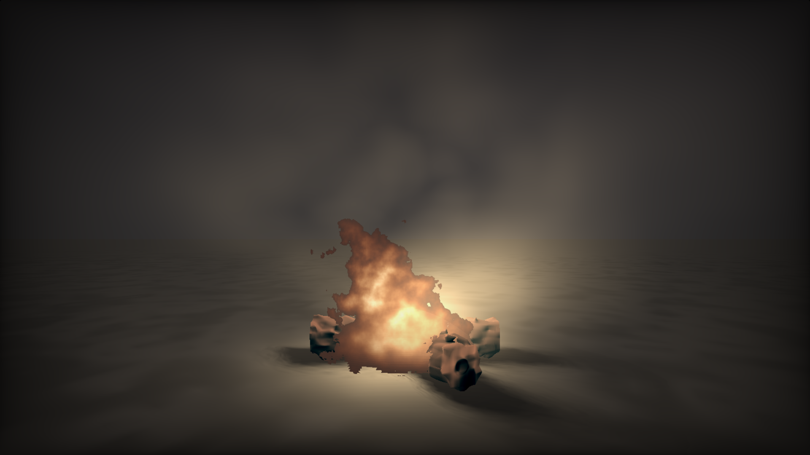

# CIS 566 Homework 3: Environment Setpiece

## ID
 - __Name:__ Jiangping Xu
 - __PennKey:__ xjp

Citation
----------
[Cloud by iq](https://www.shadertoy.com/view/XslGRr)\
[Fire by xbe](https://www.shadertoy.com/view/XsXSWS)

Demo
---------
https://www.shadertoy.com/view/Wdj3DV
\
use mouse to control the camara

Implementation Details
----------
- Noise. The noise I use is a 3D texture, with a size of 32 * 32 * 32. Then I use it as the base noise of FBM function and get FBM noise with different level of resolution.

- Volumetrics Rendering. Fog and fire are generated by raymarching the FBM noise. I take the noise at each raymarching step as the density of the fog and fire (energy density). The transparency of fog decreases exponentially with its density. Based on this principle, I calculate the "a" value of a small volume of fog at each time step, and combine them iteratively using the equation sum.a = 1 - (1 - sum.a) * (1 - col.a), where sum is the color of the volume we passed and col is the color of current small volume of fog. Note that 1 - a is the transparency. As for the volumetric lighting, I use iq's method to approximate the dot product between density normal and light direction by simply calculating the gradient along the light direction. (for detail please look at https://iquilezles.org/www/articles/derivative/derivative.htm) I decrease the light intensity by the distance from the light source exponentially. I approximate the fire as a point light when performing volumetric lighting. An ambient light of 0.2 is also applied.  
  I use an variable c to create the shape of fire,  

c = 1 - 16 * pow(max(0, length(vec2(pos.x, pos.z - 0.2 * pos.y) * vec2(0.11 + 0.46 * pos.y)) - 0.9 * pos.y * dp * dp), 1.2)  

  
where pos is a position and dp is the energy density at the position. When pos.y is higher, pos.xz needs to be smaller and dp needs to be higher to keep c close to 1. Then I multiply the color of fire with c. If c is less than a threshold, that pixel will be regarded as ground or firewood rather than fire. when calculating c I translate pos.z by 0.2 * pos.y so flame leans down to the wind. I use an intermediate variable to dtermine the color of flame,  

c1 = 0.05 * denf * (2.0 - pow(1.0 * pos.y, 4.))

  
where denf is the accumulated energy density along the ray. This variable make the flame brighter at the bottom. I set the color of flame as 1.6 * vec3(1.5*c1, 1.3*c1*c1, c1*c1*c1).

- SDF Firewood. The firewood is two cylinders transformed and combined together. I add displacement to it using the FBM noise to create a organic shape.

- Soft Shadow and Lighting. I cast ray from the ground to light source to create soft shadows. The shadow parameter is calculated as k * h / t, where h is the nearest distance to an obstacle and t is the distance traveled along the ray at that point. k is a coefficient to control the size of shadow. The flame is regarded as two point lights when calculating shadows. The light positions are biased to conform the shape of the flame which leads to asymmetric shadow of the firewood. Ground's lighting involves a lambert term with the normal biased randomly and a glare term to create a brighter circle around the flame. 

- Animation of Fire And Fog. When calculating the density of the fog, I translate the coordinate by time along z axis to create the motion of the fog. Same thing happens to the fire too when calculating density, so the energy seems moving upwards. I also add some effect imitating the flicker of flame. I use the fbm noise with time as input to modify the lighting on the ground and firewood. The light position is shifted by this noise when casting soft shadow.

- Vigneting. Use the function f(u, v) = u * v * (1.0 - u) * (1.0 - v) to make the border of image darker.

Scene Shot
---------
